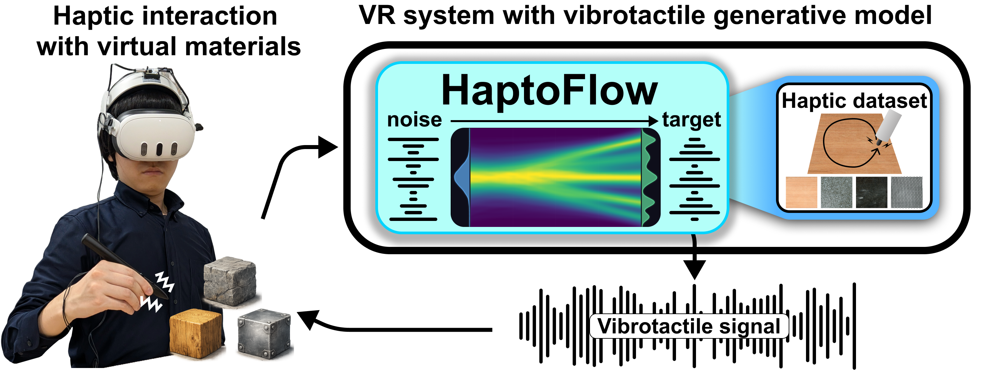
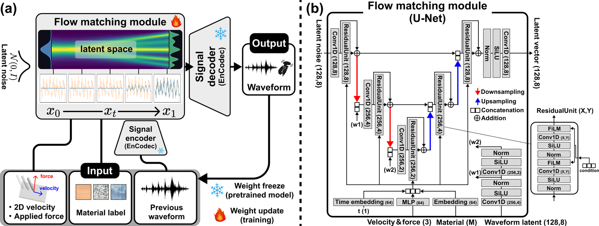

# HaptoFlow

### High-Fidelity Real-Time Vibrotactile Generation via Flow Matching for Virtual Reality

Michikuni Eguchi1,2 &nbsp;·&nbsp;
Yuichi Hiroi2 &nbsp;·&nbsp;
Takefumi Hiraki1,2

1 University of Tsukuba &nbsp;&nbsp; 2 Metaverse Lab, Cluster, Inc.

&nbsp;

&nbsp;

Official implementation of **HaptoFlow**. For the full method, experiments, and user studies, see the **[project page](https://tamago117.github.io/HaptoFlow/)**.

## Abstract

Haptic feedback is widely employed to enhance immersion in Virtual Reality (VR) environments. However, designing haptic stimuli that cover diverse interaction conditions remains a significant scalability challenge. Data-driven haptic generation has emerged as a promising approach, yet existing models face an inherent trade-off between waveform expressiveness and inference responsiveness, which becomes increasingly critical as training data grow in scale and diversity.

To address this challenge, we propose **HaptoFlow**, a vibrotactile generative model based on Flow Matching, designed for interactive real-time haptic rendering in VR. Flow Matching learns a continuous vector field that transforms a base distribution into the target data distribution, enabling efficient representation of complex haptic data distributions and thereby facilitating both high-quality generation and computational efficiency. We train HaptoFlow conditioned on material labels and interaction parameters (stroking velocity and applied force), and integrate it into a VR system.

Technical evaluation demonstrates that HaptoFlow outperforms all baseline methods in both waveform reproduction accuracy and inference latency. Furthermore, user studies confirm that the system latency falls well within the perceptual threshold of visual-haptic delay, and statistically significant improvements in perceived haptic quality are observed for a subset of materials. These findings establish a practical foundation for scalable, data-driven haptic content creation in VR, and provide latency benchmarks that inform the design of future real-time haptic rendering systems.

## Status

Code and pre-trained models are not released yet. They will be made available in this repository.

## Citation

Coming soon.

## Acknowledgments

This study was supported by JST ACT-X Grant Number JPMJAX25C4 and JSPS KAKENHI Grant Number JP25H00722, Japan.

## License

[Apache License 2.0](LICENSE)
