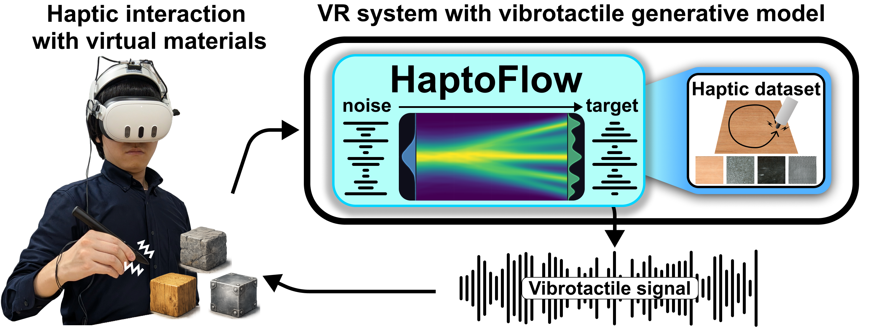
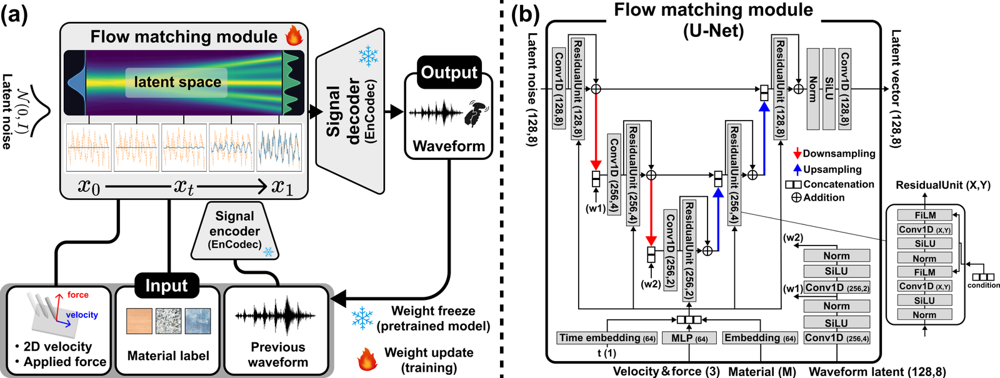
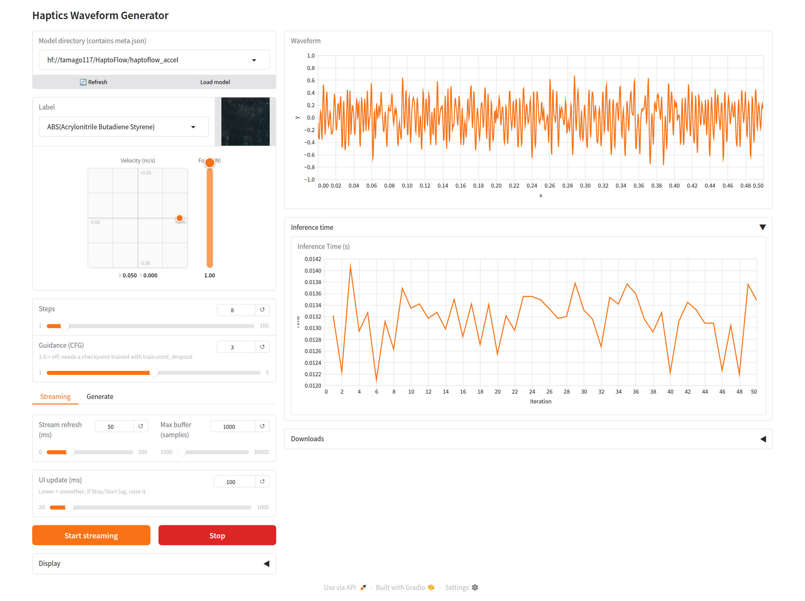

<div align="center">

# HaptoFlow

### High-Fidelity Real-Time Vibrotactile Generation via Flow Matching for Virtual Reality

Michikuni Eguchi<sup>1,2</sup> &nbsp;·&nbsp;
Yuichi Hiroi<sup>2</sup> &nbsp;·&nbsp;
Takefumi Hiraki<sup>1,2</sup>

<sup>1</sup> University of Tsukuba &nbsp;&nbsp; <sup>2</sup> Metaverse Lab, Cluster, Inc.

**ISMAR 2026**<br>
<sub>IEEE International Symposium on Mixed and Augmented Reality</sub>

<a href="https://tamago117.github.io/HaptoFlow/">
  
</a>
&nbsp;
<a href="https://arxiv.org/abs/2608.01974">
  
</a>
&nbsp;
<a href="https://huggingface.co/tamago117/HaptoFlow">
  
</a>
&nbsp;
<a href="LICENSE">
  
</a>



</div>

Official implementation of **HaptoFlow**. For the full method, experiments, and user studies, see the **[project page](https://tamago117.github.io/HaptoFlow/)**.

## Abstract

Haptic feedback is widely employed to enhance immersion in Virtual Reality (VR) environments. However, designing haptic stimuli that cover diverse interaction conditions remains a significant scalability challenge. Data-driven haptic generation has emerged as a promising approach, yet existing models face an inherent trade-off between waveform expressiveness and inference responsiveness, which becomes increasingly critical as training data grow in scale and diversity.

To address this challenge, we propose **HaptoFlow**, a vibrotactile generative model based on Flow Matching, designed for interactive real-time haptic rendering in VR. Flow Matching learns a continuous vector field that transforms a base distribution into the target data distribution, enabling efficient representation of complex haptic data distributions and thereby facilitating both high-quality generation and computational efficiency. We train HaptoFlow conditioned on material labels and interaction parameters (stroking velocity and applied force), and integrate it into a VR system.

Technical evaluation demonstrates that HaptoFlow outperforms all baseline methods in both waveform reproduction accuracy and inference latency. Furthermore, user studies confirm that the system latency falls well within the perceptual threshold of visual-haptic delay, and statistically significant improvements in perceived haptic quality are observed for a subset of materials. These findings establish a practical foundation for scalable, data-driven haptic content creation in VR, and provide latency benchmarks that inform the design of future real-time haptic rendering systems.

<div align="center">

</div>

## Getting Started

### 1. Clone the repository

```bash
git clone https://github.com/tamago117/HaptoFlow.git
cd HaptoFlow
```

### 2. Set up the environment

The project is managed with [uv](https://docs.astral.sh/uv/) (Python 3.10+). A CUDA GPU is recommended.

```bash
curl -LsSf https://astral.sh/uv/install.sh | sh   # if uv is not installed yet
uv sync
```

On Windows, `uv sync` installs the CPU build of PyTorch; see [docs/setup.md](docs/setup.md#windows-installing-pytorch-with-gpu-cuda-support) for the CUDA wheels.

To use Docker instead, see [docs/setup.md](docs/setup.md#docker).

### 3. Run the demo app

```bash
uv run scripts/serving/app_generate_waveform.py
```

Open http://127.0.0.1:7860. The pre-trained weights are downloaded from [Hugging Face](https://huggingface.co/tamago117/HaptoFlow) on first use:

| Model | Trained on |
| --- | --- |
| `hf://tamago117/HaptoFlow/haptoflow_accel` (default) | accelerometer |
| `hf://tamago117/HaptoFlow/haptoflow_audio` | audio |

<div align="center">

</div>

## Training

HaptoFlow is trained on the [Cluster Haptic Texture Dataset](https://huggingface.co/datasets/tamago117/cluster-haptic-texture-dataset) in two phases: the model is first trained, then fine-tuned on its own generations for stable continuous generation.

### 1. Download the dataset

```bash
uv run scripts/dataset/download_dataset.py
```

See [docs/dataset.md](docs/dataset.md) for details.

### 2. Convert it into a training dataset

```bash
uv run scripts/dataset/convert_dataset.py --config configs/dataset/convert_dataset.yaml
```

The recordings are preprocessed into the format used for training. See [docs/dataset_converter.md](docs/dataset_converter.md) for the options.

### 3. Phase 1

```bash
uv run scripts/train.py --model flow_matching -r haptoflow_phase1
```

### 4. Phase 2

```bash
uv run scripts/train.py --model flow_matching \
    --config configs/train/flow_matching_phase2.yaml \
    --init-from runs/haptoflow_phase1/epoch_0050 -r haptoflow_phase2
```

See [docs/training_phases.md](docs/training_phases.md) for details.

### 5. Try your model in the app

Copy a trained checkpoint under `checkpoints/` and select it in the app.

## Citation

```bibtex
@misc{eguchi2026haptoflowhighfidelityrealtimevibrotactile,
      title={HaptoFlow: High-Fidelity Real-Time Vibrotactile Generation via Flow Matching for Virtual Reality},
      author={Michikuni Eguchi and Yuichi Hiroi and Takefumi Hiraki},
      year={2026},
      eprint={2608.01974},
      archivePrefix={arXiv},
      primaryClass={cs.HC},
      url={https://arxiv.org/abs/2608.01974},
}
```

## Acknowledgments

This study was supported by JST ACT-X Grant Number JPMJAX25C4 and JSPS KAKENHI Grant Number JP25H00722, Japan.

## License

[Apache License 2.0](LICENSE)
